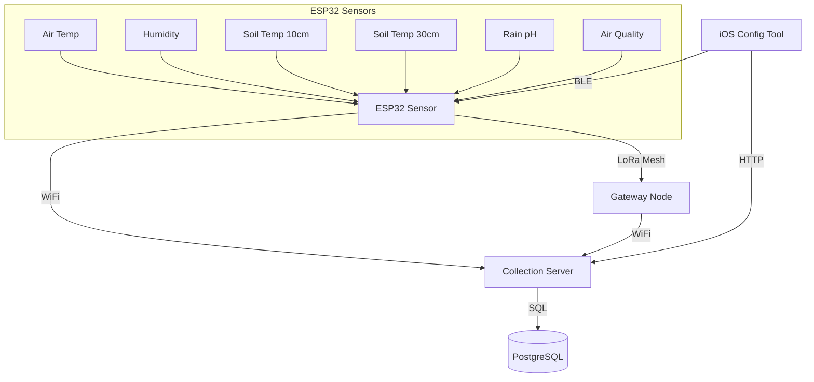
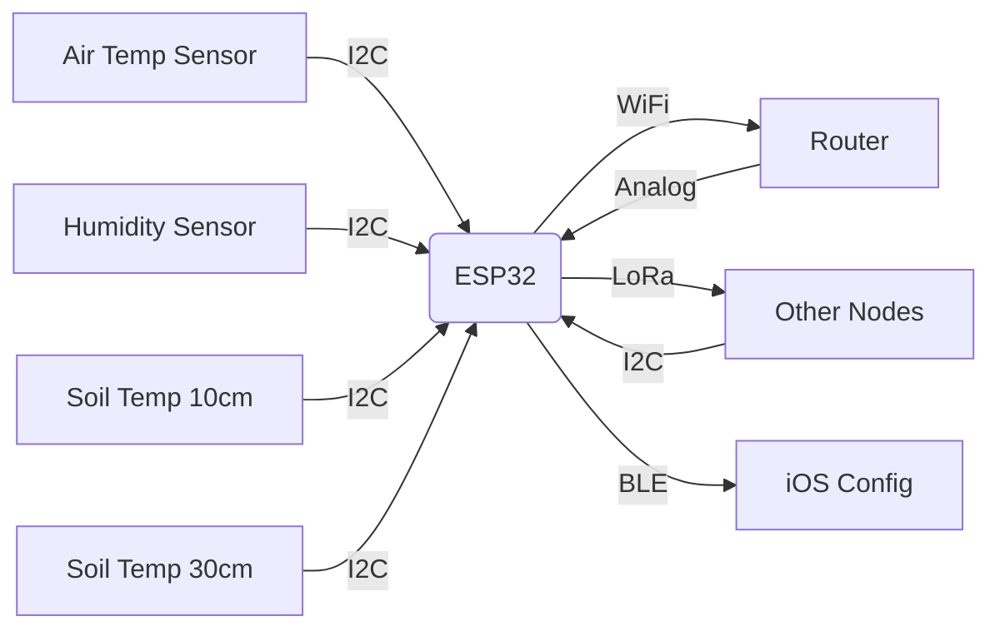

# Environmental Monitoring System

A distributed IoT solution for environmental monitoring using ESP32 with multiple connectivity options.

## System Architecture



## Components

### 1. ESP32 Sensor Node
- Measures:
  - Air temperature and humidity
  - Soil temperature at 2 configurable depths  
  - Rainwater pH
  - Air quality (VOC/CO2)
- Multiple connectivity options:
  - WiFi (direct to server)
  - LoRa Mesh (peer-to-peer)
  - BLE (configuration only)
- Self-healing mesh network capability

### 2. Collection Server
- MQTT subscriber receiving sensor data
- Stores data in PostgreSQL database
- Provides REST API for clients

### 3. iOS Configuration Tool
- Device setup and configuration
- Firmware updates via BLE
- Network troubleshooting
- Diagnostic data visualization
- Mesh network topology viewer

## Hardware Setup

### ESP32 TinyS3 Connections


Pin Configuration:
- I2C SDA: GPIO8
- I2C SCL: GPIO9  
- LoRa MOSI: GPIO11
- LoRa MISO: GPIO13
- LoRa SCK: GPIO12
- LoRa CS: GPIO10
- LoRa RST: GPIO3

## Setup Instructions

### ESP32 Requirements
```bash
micropython -m upip install umqtt.simple
```

### Server Requirements
```bash
pip install -r server/requirements.txt
```

### PostgreSQL Setup
```bash
sudo -u postgres createdb sensor_data
sudo -u postgres psql -c "CREATE USER collector WITH PASSWORD 'yourpassword';"
sudo -u postgres psql -c "GRANT ALL PRIVILEGES ON DATABASE sensor_data TO collector;"
```

## Running the System

1. Start MQTT broker:
```bash
mosquitto -v
```

2. Start collection server:
```bash
python server/mqtt_to_postgres.py
```

3. Flash ESP32 with `main.py`

4. Build and run iOS app in Xcode

## Troubleshooting

### Common ESP32 Issues
1. **MQTT Connection Failed**
   - Verify broker IP in `config.py`
   - Check network connectivity
   - Test with `mosquitto_sub -t sensors/#`

2. **I2C Sensor Not Detected**
   - Run I2C scanner:
   ```python
   from machine import I2C, Pin
   i2c = I2C(0, sda=Pin(8), scl=Pin(9))
   print(i2c.scan())
   ```

3. **Memory Errors**
   - Enable PSRAM in firmware
   - Reduce sensor update interval

### Server Issues
1. **Database Connection Failed**
   - Verify PostgreSQL service is running
   - Check credentials in `mqtt_to_postgres.py`

2. **MQTT Message Not Received**
   - Test broker with:
   ```bash
   mosquitto_sub -t sensors/environment -v
   ```

## Future Enhancements
- [ ] Add authentication for MQTT
- [ ] Implement data encryption
- [ ] Add alerting system
- [ ] Dashboard for data visualization
- [ ] OTA firmware updates
