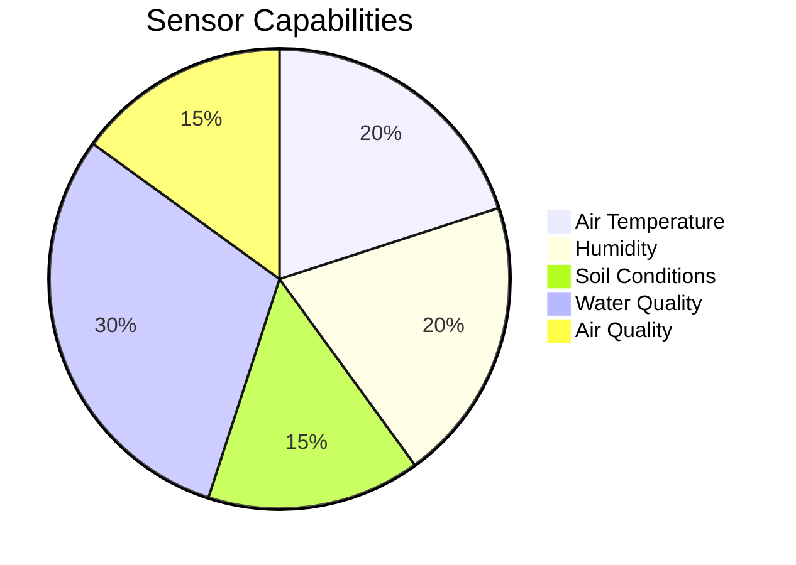
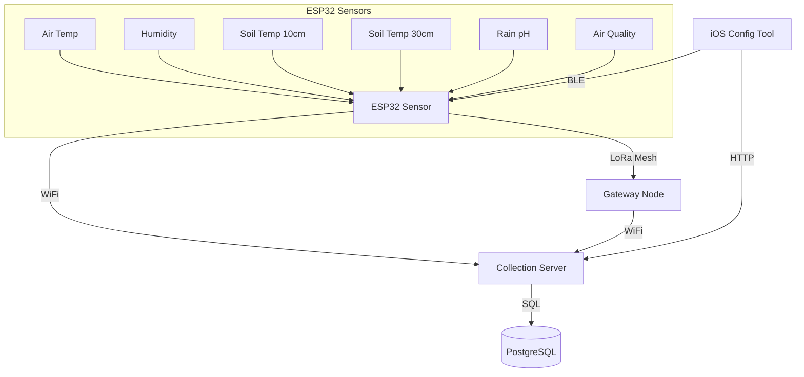
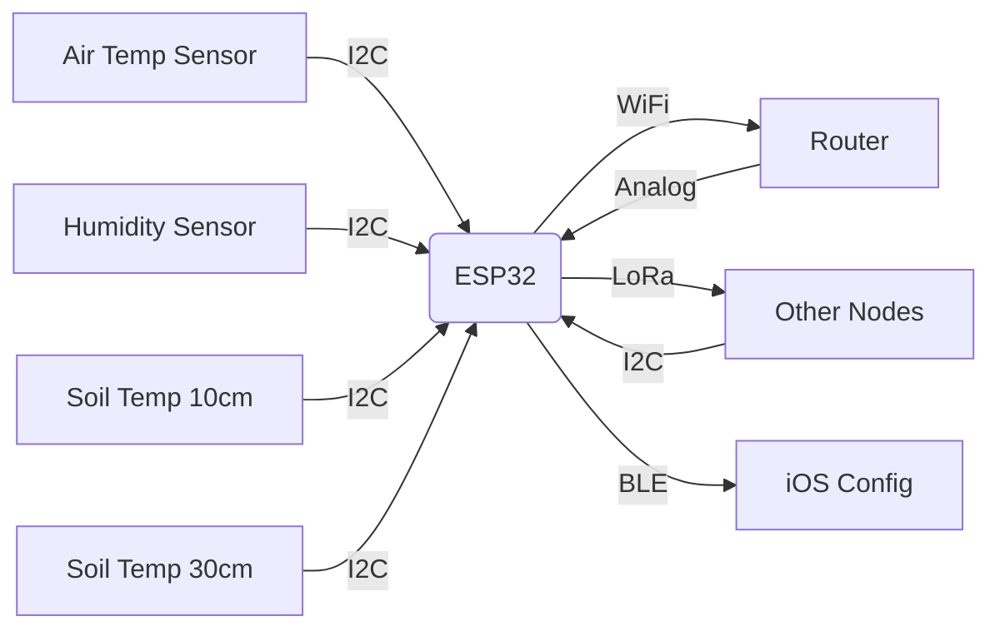
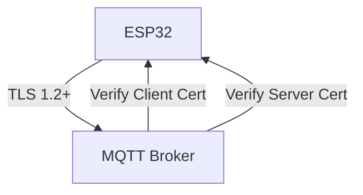

# Environmental Monitoring System for Everyone

An open, hackable IoT solution for environmental monitoring using affordable off-the-shelf components. Perfect for:

- Small farms and homesteads tracking pasture conditions
- Community gardens monitoring soil health
- STEM education projects (ages 12+ with adult supervision)
- Citizen science initiatives
- Backyard weather stations
- Livestock environmental monitoring

## Why Build This?

- **Affordable**: Uses $20 ESP32 boards and common sensors
- **Customizable**: Python and Swift code is easy to modify
- **Offline-Capable**: Local data collection option (no internet needed)
- **Educational**: Great for learning IoT, Python, and electronics
- **Practical**: Real-world environmental insights

## What You Can Monitor



### Water Quality Monitoring
- **Temperature**: Critical for aquatic life and chemical reactions
- **pH**: Acidity/alkalinity levels (ideal range 6.5-8.5 for most aquatic life)
- **Turbidity**: Water clarity (measured in NTU)
- **TDS**: Total Dissolved Solids (measures mineral content)

Recommended sensors:
- Atlas Scientific pH Kit (~$100)
- TDS Meter (~$15)
- Turbidity Sensor (~$30)
- Waterproof DS18B20 Temperature Sensor (~$10)

## Get Started in 3 Steps

1. **Gather Parts**:
   - ESP32 board (TinyS3 recommended)
   - BME280 (temp/humidity) - $5
   - DS18B20 soil probes - $8 each
   - Analog pH sensor - $15
   - SCD30 air quality - $30

2. **Assemble**:
   - Connect sensors via I2C/GPIO
   - Flash provided MicroPython code
   - Power with USB or battery

3. **Collect Data**:
   - View real-time dashboards
   - Export CSV for analysis
   - Set up alerts (e.g. frost warnings)

Perfect for weekend projects or classroom activities!

## System Architecture



## Components

### 1. Local Data Collector (Raspberry Pi)
- Lightweight MQTT-to-SQLite collector
- Designed for offline/remote deployments
- Features:
  - Local SQLite storage (no internet required)
  - Compatible with same MQTT messages as cloud version
  - Data retention management
  - Low resource usage
- Setup:
  ```bash
  cd data-collector-local
  ./setup.sh
  source data-collector-env/bin/activate
  python server.py
  ```

### Building the Debian Package

To build the Debian package (requires Docker):

```bash
cd data-collector-local
chmod +x build-deb.sh
./build-deb.sh
```

This will create a `data-collector-local_1.0.0_all.deb` package that can be installed with:

```bash
sudo dpkg -i data-collector-local_1.0.0_all.deb
```

The package includes:
- Systemd service unit
- Configuration files
- Manpage documentation
- Automatic user creation

### 2. ESP32 Sensor Node
- Measures:
  - Air temperature and humidity
  - Soil temperature at 2 configurable depths  
  - Rainwater pH
  - Air quality (VOC/CO2)
- Multiple connectivity options:
  - WiFi (direct to server)
  - LoRa Mesh (peer-to-peer)
  - BLE (configuration only)
- Self-healing mesh network capability

### 2. Collection Server
- MQTT subscriber receiving sensor data
- Stores data in PostgreSQL database
- Provides REST API for clients

### 3. iOS Configuration Tool
- Device setup and configuration
- Firmware updates via BLE
- Network troubleshooting
- Diagnostic data visualization
- Mesh network topology viewer

## Hardware Setup

### ESP32 TinyS3 Connections


Pin Configuration:
- I2C SDA: GPIO8
- I2C SCL: GPIO9  
- LoRa MOSI: GPIO11
- LoRa MISO: GPIO13
- LoRa SCK: GPIO12
- LoRa CS: GPIO10
- LoRa RST: GPIO3

## Setup Instructions

### ESP32 Requirements
```bash
# Install build dependencies
sudo apt-get install -y jq
dotnet tool install -g GitVersion.Tool

# Setup environment and build
./setup_uv.sh
./build_firmware.sh
```

### Server Requirements
```bash
pip install -r server/requirements.txt
```

### PostgreSQL Setup
```bash
sudo -u postgres createdb sensor_data
sudo -u postgres psql -c "CREATE USER collector WITH PASSWORD 'yourpassword';"
sudo -u postgres psql -c "GRANT ALL PRIVILEGES ON DATABASE sensor_data TO collector;"
```

## Deployment Options

### Cloud Deployment (Recommended)
1. PostgreSQL database server
2. MQTT broker with TLS
3. Central collection server

### Local/Offline Deployment
1. Raspberry Pi or local server
2. Local MQTT broker (no TLS required)
3. SQLite-based data collector:
   ```bash
   cd data-collector-local
   ./setup.sh
   python server.py
   ```

## Running the System

1. Start MQTT broker (for either deployment):
```bash
mosquitto -v
```

2. Start collection server:
```bash
python server/mqtt_to_postgres.py
```

3. Flash ESP32 with `main.py`

4. Build and run iOS app in Xcode

## Troubleshooting

### Common ESP32 Issues
1. **MQTT Connection Failed**
   - Verify broker IP in `config.py`
   - Check network connectivity
   - Test with `mosquitto_sub -t sensors/#`

2. **I2C Sensor Not Detected**
   - Run I2C scanner:
   ```python
   from machine import I2C, Pin
   i2c = I2C(0, sda=Pin(8), scl=Pin(9))
   print(i2c.scan())
   ```

3. **Memory Errors**
   - Enable PSRAM in firmware
   - Reduce sensor update interval

### Server Issues
1. **Database Connection Failed**
   - Verify PostgreSQL service is running
   - Check credentials in `mqtt_to_postgres.py`

2. **MQTT Message Not Received**
   - Test broker with:
   ```bash
   mosquitto_sub -t sensors/environment -v
   ```

## Security Configuration



### Recommended Authentication Methods:
1. **Client Certificates (Most Secure)**
   - Uses mutual TLS authentication
   - Requires:
     - CA certificate
     - Client certificate
     - Client private key
   ```bash
   # Generate certificates (run on server)
   openssl req -new -x509 -days 365 -nodes -out ca.crt -keyout ca.key
   openssl genrsa -out client.key 2048
   openssl req -new -out client.csr -key client.key
   openssl x509 -req -in client.csr -CA ca.crt -CAkey ca.key -CAcreateserial -out client.crt -days 365
   ```

2. **API Keys (Medium Security)**
   - Simple token-based authentication
   - Configure in `config.py`:
   ```python
   AUTH_MODE = "API_KEY"
   MQTT_API_KEY = "your-long-random-key"
   ```

3. **Username/Password (Basic Security)**
   - Traditional credentials
   - Configure in `config.py`:
   ```python
   AUTH_MODE = "USERPASS"
   MQTT_USER = "username"
   MQTT_PASSWORD = "strong-password"
   ```

### Certificate Deployment:
1. Place certificates on ESP32:
```bash
ampy put certs/client.crt /certs/client.crt
ampy put certs/client.key /certs/client.key
ampy put certs/ca.crt /certs/ca.crt
```

2. Configure server certificates:
```bash
mkdir -p server/certs
cp ca.crt server/certs/
cp server.{crt,key} server/certs/
```
- [ ] Implement data encryption
- [ ] Add alerting system
- [ ] Dashboard for data visualization
- [ ] OTA firmware updates

## GitHub Repository
The project is hosted at: https://github.com/codeSnapped-LLC/environmental-monitor
